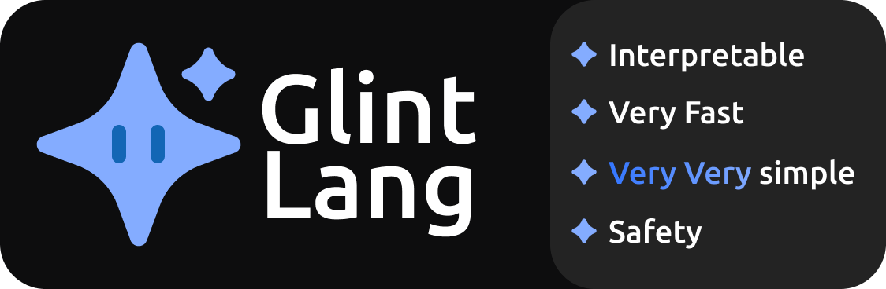
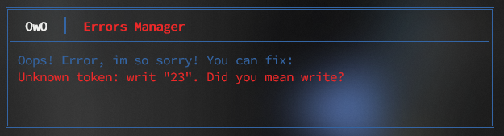

## Welcome to Glint!

Glint is a lightweight programming language designed for simplicity and performance. It combines both interpreter and compiler capabilities to cater to diverse programming needs.

### Features:
- **Interpreted and Compiled:** Glint offers both interpreted and compiled modes. By using `use compiler` and `stop use compiler`, developers can opt for a compiled approach where the syntax includes braces `{}`, introduces typing, and addresses memory safety concerns—ideal for those requiring features typical of compiled languages.

- **Error Handling:** Glint provides robust error handling with clear feedback to aid debugging.

  

- **Simplicity:** Glint features a straightforward syntax that promotes readability and ease of understanding.

- **Performance:** Optimized for speed, Glint outperforms Python and competes closely with languages like JavaScript, Java, and Ruby in benchmarks.

- **Dynamic Typing:** Supports dynamic typing for flexibility without explicit type annotations.

### Getting Started
To begin using Glint:
1. **Installation:** Clone the repository and compile Glint using Rust's Cargo:
   ```bash
   git clone https://github.com/your_username/glint.git
   cd glint
   cargo build --release
   ```

2. **Run a Glint Program:** Execute a Glint program by passing a `.glt` file as an argument:
   ```bash
   cargo run run my_program.glt
   or
   Glint run my_program.glt
   ```

### Documentation
Explore the Glint documentation [here](I'm_almost_done_with_it,_sorry).

### Examples
Discover the simplicity and power of Glint with these examples:
- **Hello World:**
  ```Glint
  write "Hello, World!"
  ```

- **Simple Arithmetic:**
  ```Glint
  a is 10
  b is 20
  sum is a + b
  write "Sum:", sum
  ```

### Contributing
Contributions to Glint are welcome! Fork the repository and submit pull requests.

### License
Glint is licensed under the MIT License. See [LICENSE](https://github.com/Glint-Lang/Glint?tab=MIT-1-ov-file) for details.


### Make your code flexible with Glint✨

---

Join us in making programming simpler and faster with Glint! 🚀

